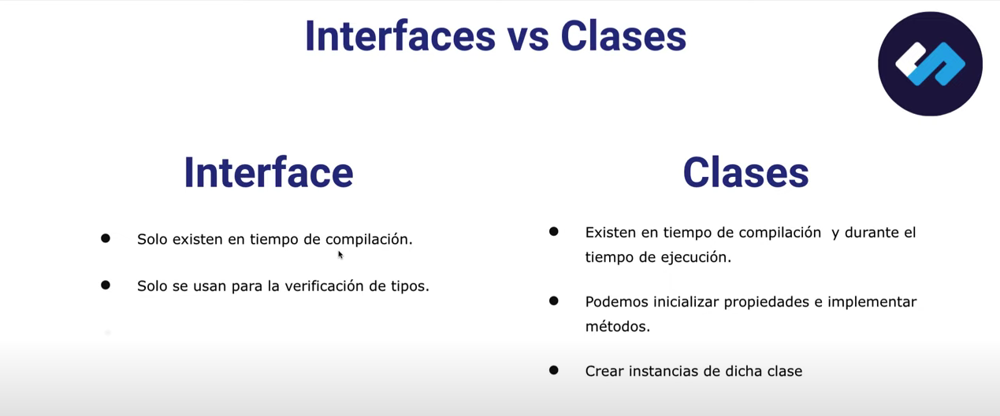

### Comprobacion de versiones de Node, NPM y TSC

```
node --version
npm --version
tsc --version
```

Creando un archivo **`index.ts`**
Para compilar y ejecutar:

```
tsc index.ts && node index.js
```

Crear una carpeta llamada **`src`**
Crear un archivo **`index.ts`**
Crear una carpeta **`dist`**

Ejecutar el siguiente comando para crear el archivo **`tsconfig.json`**:

```
tsc --init
```

Hacer las modificaciones en **`tsconfig.json`**

```json
"outDir": "./dist",
"rootDir": "./src",
"target": "es2016",
"strictPropertyInitialization": false,
"moduleResolution": "node"
```

Ahora al escribir el código y compilar necesito el siguiente comando:

```
tsc
```

---

## Tipos de datos primitivos

```ts
let myString: string = "Bienvenidos a Typescript";
let myNumber: number = 35;
let myBoolean: boolean = true;

// Arrays

let arrayString: string[] = ["A", "B", "C"];
let arrayNumber: number[] = [5, 8, 20];
let arrayBoolean: boolean[] = [true, false];
let arrayAny: any[] = [true, "string", 30];

//Tuple
let tupleArray: [string, number, boolean] = ["string", 30, true];

// Tuple array
let players: [number, string][];

players = [
  [25, "A"],
  [30, "B"],
  [50, "C"],
];

// Tipos por inferencia
let myVariable = 60; // de any a number

// Unions: Una variable puede ser de uno o mas tipos

let myVariable2: string | number | null;
```

---

## Enums objects

```ts
enum Roles {
  User = "USER",
  Admin = "AMIN",
  SuperAdmin = "SUPERADMIN",
}

console.log(Roles.Admin);
```

---

## Type assertion

```ts
// Si no sabemos el tipo de un valor, lo podemos transformar

let channel: any = "Coderhouse";

// let channelStr = <string>channel
let channelStr = channel as string;

// const myCanvas = document.getElementById('main') as HTMLCanvasElement
const myCanvas = <HTMLCanvasElement>document.getElementById("main");
```

---

## Functions

```ts
function greet(name: string = "USER"): void {
  console.log(`Welcome ${name}`);
}
//Al agregar 'void' es porque no retornamos nada
// Al agregar "USER" toma el parámetro por defecto

greet("Alumno");

function getNumber(): number {
  return Math.floor(Math.random() * 100);
}

console.log(getNumber());

function printPosition(position: { lat: number; long: number }) {
  console.log(`LAT: ${position.lat}, LONG: ${position.long}`);
}

printPosition({ lat: 10, long: 30 });
```

---

## Diferencia entre Interface y Clase



¿Que es una interface?

- Es una definicion de contrato de código.
- Una interface define la "forma" de la data, con la que vamos a trabajar.

```ts
interface Book {
  id: number;
  title: string;
  author: string;
  coAuthor?: string;
  isLoan: (id: number) => void;
}
```

```ts
const book: Book = {
  id: 1,
  title: "Titulo",
  author: "Autor",
};
```

```ts
const books: Book[] = [];
```

```ts
function getBook(): Book {
  return { id: 1, title: "Titulo", author: "Autor" };
}
```

Extendiendo interfaces

```ts
interface Person {
  id: number;
  name: string;
}

interface Employee extends Person {
  dept: string;
}

interface Customer extends Person {
  country: string;
}
```

---

## Clases

```ts
class Employee {
  //Atributos

  constructor(private id: number, private name: string, private dept: string) {
    this.showInfo();
  }

  //Métodos
  private showInfo(): void {
    console.log(`${this.name} - ${this.dept}`);
  }
}

const emp = new Employee(1, "Coderhouse", "Sales");
```

---

## Generics

```ts
interface Person {
  id: number;
  name: string;
}

interface Employee extends Person {
  role: string;
}

interface Product {
  id: number;
  name: string;
  price: number;
}

class DataCollection<T> {
  private items: T[] = {};

  addItem(newItem: T): void {
    this.items.push(newItem);
  }

  getItems(): void {
    console.log(`List of items`, JSON.stringify(this.items));
  }
}
const productCollection = new DataCollection<Product>();

const newData2 = {
  id: 2,
  name: "Beer",
  price: 333,
};

productCollection.addItem(newData2);
```

---

_Source:_ https://youtu.be/IJ_mpJRaHmc
